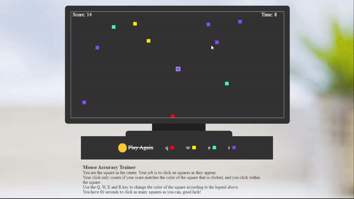

# OSSLab Final Project 2021-1

## What is the purpose of this project?
This is a simple mouse accuracy minigame created entirely in HTML.
Everyone is on the computer a lot, especially nowadays. I personally suffer from pretty poor mouse accuracy even in daily use computing
So I made this little game based on [Photon](https://github.com/pmueller/photon) by pmueller to hopefully improve that.

## Instructions
- You are the square in the center. Your job is to click on squares as they appear.
- Your click only counts if:
	* Your square matches the color of the square that is clicked.
	* You click within the square.
- Use the Q, W, E and R keys to change the color of the square according to the legend ingame.
- You have 60 seconds to click as many squares as you can. Good luck!

## To play
- Head to https://maibi00.github.io/OSSLab_Final 

or if you'd rather play it locally,

1. Clone the repo
2. Launch index.html in your browser of choice.
3. That's it!

## References
[W3schools](https://www.w3schools.com/)
[Photon](https://github.com/pmueller/photon)
[MouseAccuracy](https://github.com/mbowen13/MouseAccuracy)

## About
- Added from Photon:
	* Local highscore list
	* Start & Restart button
	* SFX for successfully clicking and missing squares
	* Bugfixes to logic as detailed in changelog.txt
	
For further assistance, please contact 21800827@handong.edu